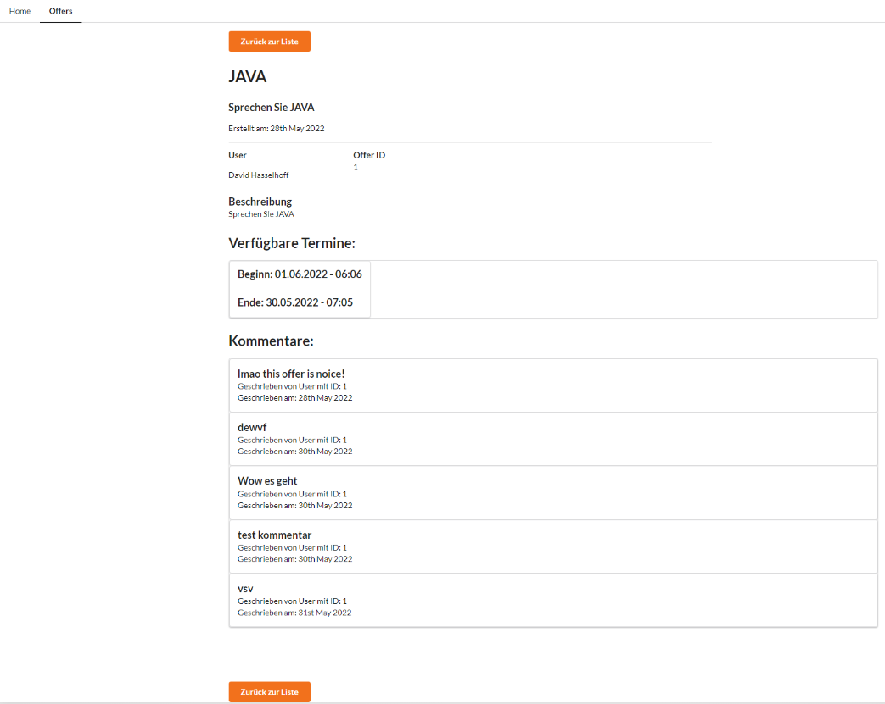

# KWM Go Student
Die ideale Plattform für Nachhilfe - von KWM für KWM.

Dutzende Fächer und Termine rund um die Uhr. Egal ob du Nachhilfe suchst oder sie anbietest. Bei uns bist du richtig!

## Nützliche Links
- [GitHub](https://github.com/CiLLiTxBanger/KWM-Go-Student) - master branch
- [Webpage](http://kwmgostudent.s1910456007.student.kwmhgb.at/) - Nur BE
- [Webpage](http://angular2.s1910456007.student.kwmhgb.at/) - Anwendung
- [Mail](mailto:S1910456007@students.fh-hagenberg.at) - S1910456007@students.fh-hagenberg.at

## Login Daten der User (von Seeder)
Nachhilfe-Geber: test@gmail.com secret 
Nachhilfe-Sucher: test2@gmail.com secret2

## Weitere Informationen
Auf GitHub, sowie am Server, liegen die Angular-Daten im entsprechenden Ordner "angular".

Die gängigen GET-Methoden sind auch ohne Login möglich. Die meisten Funktionen sind allerdings hinter einer Authentifizierungs-Middleware. Nach dem Einloggen gibt es dann die Möglichkeit:
- Angebote zu erstellen
- Angebote zu löschen
- Angebote zu bearbeiten
- Termine zu einem bestimmten Angebot hinzuzufügen
- Termine zu löschen
- Termine zu bearbeiten
- Kommenatre zu einem bestimmten Angebot zu verfassen
- Zusätzlich verschiedene Sichten

## Seiten

- [angular2.s1910456007.student.kwmhgb.at/](http://angular2.s1910456007.student.kwmhgb.at/) - Home
- [http://angular2.s1910456007.student.kwmhgb.at/#/offers](http://angular2.s1910456007.student.kwmhgb.at/#/offers) - Angebotsübersicht
- [http://angular2.s1910456007.student.kwmhgb.at/#/offers/1](http://angular2.s1910456007.student.kwmhgb.at/#/offers/1) - Eine Detailseite
- [http://angular2.s1910456007.student.kwmhgb.at/#/login](http://angular2.s1910456007.student.kwmhgb.at/#/login) - Login
- [http://angular2.s1910456007.student.kwmhgb.at/#/account](http://angular2.s1910456007.student.kwmhgb.at/#/account) - Profil

## DatenbankSchema

Datenbankschema

## Routen
api.php

app-routing.module.ts

## Screenshots der Website
Detailseite ohne Login

Detailseite mit Login
Vergebene Termine werden nicht angezeigt. Freie Termine sind weiß hinterlegt.

Detailseite mit Login & anderes Profil.  
Der grün hinterlegte Termin ist von diesem User selbst angenommen worden und wird daher schon angezeigt.

Profil mit gebuchten Terminen

## Problemstellen
- Datum: Konvertieren zwischen Datenbank und Angular Form war nicht einfach. Ich habe jetzt folgende Lösung mithilfe von moment.js gefunden: `moment(timeslot.start).format('YYYY-MM-DDTHH:MM:SS.SSS')`
- Mitschicken von Relationen mithilfe von `::with`. Teilweise schwierig die Relationen mit for-Schleifen aufzudrösseln. Einsatz im Profil, da dort der User aufgerufen wird, welcher Offers hat, welche wiederum Timeslots haben.

